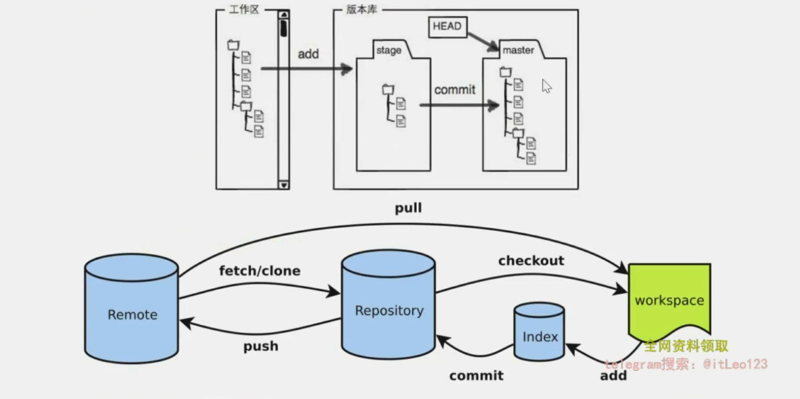

# Git

## 远程连接 ssh

ssh-keygen -t rsa -C "1179338635@qq.com"

生成公钥

## 查看是否连接成功

ssh -T git@github.com

## git本地客户端

### Windows 、Ubuntu  


## git常用命令

### 常用的基本操作命令


 从 github 上拉去项目到当前文件


查看该项目的 更新日志


查看当前拉去文件的 remote 名字


```
拉去下来的名字是默认的 origin
```

查看拉去项目的 remote 名字


#### 上传

##### 总结




##### 具体操作


```
当前的 github 文件里的 HelloWorld 文件就是当前的工作区

```


```
通过 git status 查看当前暂存区文件情况
如图，已将 ThreadPool 文件放入 C-lib ，但是未加入 暂存区
```


```
使用 git add 将文件放入暂存区：
	git add 文件名 --》 将指定文件放入暂存区
	git add .     --》 将所有文件放入暂存区
	
```


```
此时 采用 git status 查看本地会发现已经创建了新的文件 成功
```


```
采用 git commit -m "说明" 将文件传输到本地仓库代码分支的 master 分支上
此时，会反馈本地仓库的更新时间晚于远程仓库，提示更新远程仓库
```


```
把当前仓库上的 master 分支上的代码推送到远程仓库 origin 的 master 分支上

如果 本地仓库的分支 和 远程仓库上的分支 一致，就可以携程 git push origin master:master
																本仓分 远仓分
注意：这个 master 只是一个分支名，也有可能是 main	
```


```
传输完成
```


```
完成
```


```
查询当前所在分支
```


```
通过 git pull 将本地仓库更新（之前已经拉取，但是仓库有更新了，不需要使用重新拉取所有项目，只需要用 git pull 拉取更新的文件即可
```


------

### 各阶段版本的回退命令


#### 回退工作目录到 拉取时


```
git checkout -- <文件名> / <.> (回退全部文件)
☆☆☆☆☆☆ 注意： “--” 千万不能忘了，不然会把 文件名 当作分支名 切换了

回退工作区文件 《==》 本质就是用本地仓库文件覆盖工作区

未 git add
场景：当从远程仓库上拉取到本地，这时，本地仓库就会被远程仓库覆盖，然后本地仓库将文件拷贝一份放入工作区，供牛马修改，但是牛马修改文件后，工作目录下的文件就已经被修改了，此时牛马不想要这些修改并且想回到最初拉取下来的样子
```

#### 取消 暂存区 的提交


```
取消 暂存区 的修改

将文件 提交到 暂存区后
git reset HEAD 《文件名》 //不加文件名就是全部删除
```

#### 取消 本地仓库 的提交


```
git reset --hard 《commit-id》 回退到的版本
```


回退远程仓库上的代码


```
先回退自己本地仓库到满意再远程更新
git push -f origin master
在确定没有其他人提交代码的情况下，强制提交自己本地仓库上的代码

如果发现有别人提交过代码，必须先更新后在提交自己修改的代码
```

### 推送代码冲突解决方案


```
git pull 更新后会自动把代码合并
git pull 解决不了就用 git diff HEAD -- <文件名> 
```


```
将 图1  手动修改为 图2 解决冲突

阿亮先提交了，小张再提交，两人修改的是同一地方，git 无法帮助合并，因此需要手动协调冲突
```

------

### git 分支版本控制命令

#### 本地分支管理


```
其实 在本地上见分支与将远程仓库上的拉到 master 分支，直接在 master 分支上直接开发的写法是一样的，但是这样的好处是：再本地的 master 上建立分支，将代码在本地新分支上调试好了，再与master分支合并，在这段时间内不会影响到本地 master 分支，也就不需要再代码写错的时候回溯 master 分支上的代码，相当于给 master 开辟了一个副本，改崩溃了直接就把 新分支 删除就行了。
```


```
查看 本地 远程 分支的三种办法
```

##### 在本地创建 分支


```
在本地 基于master 创造一个新的分支 叫作： sortdev，并切换到 sortdev 分支
此时的 HEAD 指针指向 sortdev 分支

这是两个命令合并使用
git branch 'sortdedv' 		//在本地创建 sortdev 分支，如果有就创建失败
git checkout 'sortdev'		//切换到 sortdev 分支
```

##### 查看 本地仓库与远程仓库的分支对应关系

##### 

```
查看 本地仓库分支 与 远程仓库分支的 对应关系
master（本） --》  master（远）
sortdev(本) --》   无
```

##### 合并分支


```
git merge 分支名

HEAD 指针有切换回来，指向 master 分支
```

##### 删除分支


```
git branch -d sortdev 		// 如果没有将 sortdev 合并，此指令不能删除 sordev 分支
git branch -D sortdev		//  强制删除，适用于写错了，重写，不想要此分支了
```

##### 不合并，直接将 本地新分支上的代码 提交给远程仓库


------

##### 合并分支冲突


------

#### 远程分支管理


```
在本地仓库 创建一个 dev 分支并且将它连接到 远程仓库的 dev 分支上
```


```
此时，本地仓库的 dev 分支就连接到 远程仓库的 dev 分支上
```


## git --help 查看所有命令

